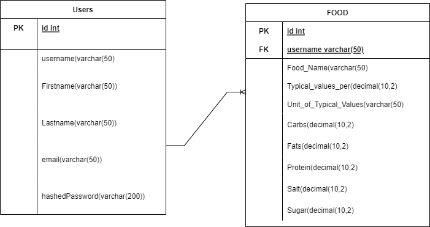

# myapp

The ER Diagram above displays as one-to-many relationship between the two tables. The term one-to-many relationship is used to describe a realtionship where a single entity (in my case the "Users" entity) is related to one or more records in the second entity (in the case of the "FOOD"entity). This relationship is registered via the presence of the foreign key in the "FOOD" table which references the primary key in the "Users" table.
# Key Note 
The pages where you add food will only work if the values for the carbs Protein salt sugar are decimals, the unit of Typical_Values_per is alpha and the Typical_Values_per are integers otherwise the validations will kick in, the same format will be showing in regards to accessing the api.
The way to set up postman is to login, click plus on the overview, change the api method to either get, put, post or delete.Paste this link into the url http://www.doc.gold.ac.uk/usr/154/api into the box, tick raw and make sure the script language is json.The way to type in the body will be displayed down below in the api section.

# R1
R1 The Home Page requirement was met in the views folder in the ejs called index.js the whole folder has to be read as everything is linked to meeting the homepage requirement same for R1A and R1B.
# R2 
R2 About page was met in the views folder with the ejs been called about.ejs. The developer name is on line 10 of the ejs and the link to the home page is on line 9
# R3
R3A: Register page: this requirement was met in the register.ejs of the views folder from line 11 to line 16 for requirement R3A  regarding the form that will dsiplay the data to be collected and the code managing the back end requirement.
# R3B
R3B was in the routes folder in the file called main.js from  line 116 to line 150.
#R3C
R3C requirement was met from line 141 to line 144 in main.js
# R4
R4: Login page: R4A: was met via the ejs file in the views folder called login.ejs from line 8 to line 13
# R4B
R4B: was met in the main.js file from line 52 to line 88
# R4C
R4C: this requirementwas met in the main.js file from line 83-95
# R5
R5: Logout: This requirement was met from line 547 to line 555 in the main.js file and the index.ejs file which stores the link at line 17
# R6
R6: Add food page (only available to logged-in users): This achieved by using redirectLogin in line 157 of the main.js file
# R6A
R6A:This requirement was met in the file called addFood.ejs in the views folder from line 9 to line 20
# R6B
R6B:This requirement was met in main.js file from line 170 to line 180 including the going beyond aspect at line 170
# R6C
R6C: this requirement was met in line 180 in the main.js file.
# R7
# R7A
This requirement was met by creating the  searchFoodejs page to search for the food from line 2 to line 16
# R7B
This requirement was met in the main.js file from line 203 to line 218
# R7C
This requirement was met in the main.js file in line 203
# R8 
This requirement was met in the main.js file in line 227 using the redirectLogin function
# R8A 
This requirement was met in the updateFood.ejs file from line 8 to line 13 
# R8B
This was met in the main.js file from line 242 to line 258 for passing the data related to the food searched for and line 253 if the food isn't found , the data form is then displayed in the updateFoodforms.ejs from line 12 to line 23, the form is then passed back to the database to be updated from line 286 to line 292 in main.js and the going beyond aspect of only the user who entered the food is met at line 285
# R8C
This was met in updateFoodforms.ejs by creating an alertbox asking the user if they are sure they want to delete the form from line 25 to line 33, with the actual process of deleting it being implemented in the main.js from line 320 to line 327 with the going beyond method being implemented in line 318.
# R9A
This was met in the listFood.ejs file from line 10 to line 38
# R9B 
This was met from line 11 to line 40 in listFood.ejs

# R9C
This was met in line 35 to 36 of the listFood.ejs for the user to input the amount of calories to calculate , with each food selected by typing a number in the input box and the actual calculations occurring in the main.js from line 382 to line 445

# R10 
This was met by creating a link to it in index.js on line 14, then the actual system that handles it from line 456 to line 477 for the api.get with the method to add to database with the get method using postman is just typing this in the url
/api?keyword=(this will contain the foods related to the name) or just click on the link called api it is a get method. The post api method was in main.js from line 483 to line 494. The put method was implemented in main.js from line 500 to line 510.  The delete method was implemented in main.js from line 516 to line 537.

# R11
All form validations for each page were in the main.js on lines 50,110,162,195,232,267, and 356 with most of the req.body fields being sanitized to prevent cross scripting attacks.
# R12 
This was met in the create db.sql file 
The post method was done by me using postman and writing the food to be added to the database using the follwing body
{
    "username":"Itachi",
    "Food_Name":"Steak",
    "Typical_Values_per":"195",
    "Unit_of_Typical_Values":"gram",
    "Carbs":"48.0",
    "Fats":"1.22",
    "Protein":"7.2",
    "Salt":"0.012",
    "Sugar":"0.7"
}
The put method which would be used to updated the database would be done similary using postman by doing
{
    "id":"11",
    "Typical_Values_per":"409",
    "Unit_of_Typical_Values":"gram",
    "Carbs":"27",
    "Fats":"22.14",
    "Protein":"25.13",
    "Salt":"0.09",
    "Sugar":"5.01"  
}
and the delete method was done by similary testing fashion in postman 

{
    "Food_Name":"Steak" 
}

My Css files should be read as i made multple changes to the css like adding hovering, padding, link transitions, hovering on tables and a different color choices.

